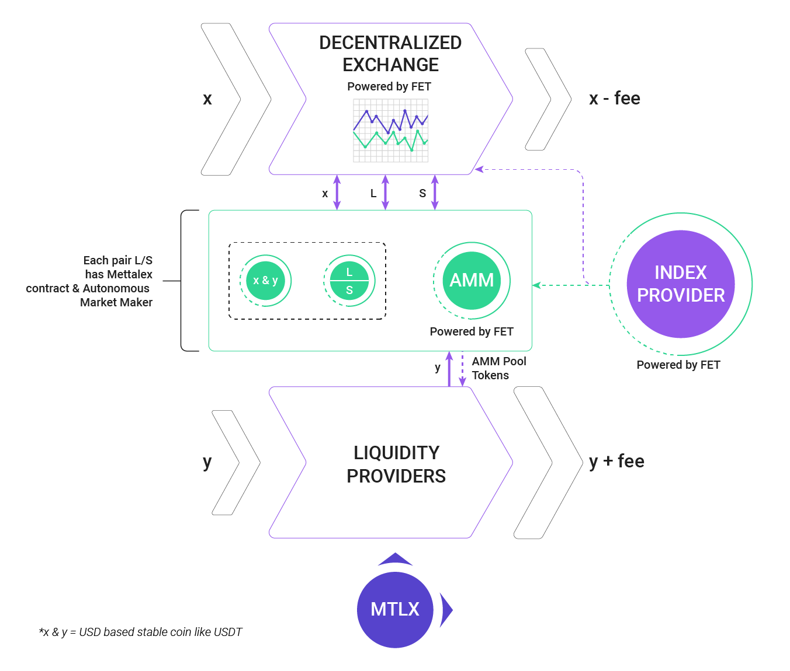

# Mettalex DEX
The Mettalex Decentralised Exchange (DEX) consists of several distinct layers:

* liquidity provision - this makes use of [audited contracts from the yearn ecosystem](https://github.com/iearn-finance/yearn-audits)
* decentralised exchange - this makes use of [audited contracts from the Balancer ecosystem](https://docs.balancer.finance/protocol/security/audits) together with a [Mettalex Pool Controller](on-chain/pool-controller/contracts/StrategyBalancerMettalexV2.sol) acting as a smart pool
* [Mettalex vault](on-chain/mettalex-vault/contracts/vault/Vault.sol) - this stores the collateral acting backing the position tokens 

The [Mettalex vault](on-chain/mettalex-vault/contracts/vault/Vault.sol) allows traders and market makers to mint pairs of long and short position tokens by locking collateral.  It also allows redemption of a long and short pair for the underlying collateral.

The on-chain market maker allows traders to enter/exit a single-sided position without going through
the "mint pair and sell one side" flow.

The market maker itself is a  [Mettalex Pool Controller](on-chain/pool-controller/contracts/StrategyBalancerMettalexV2.sol) contract 
that makes use of a private [Balancer](https://balancer.finance) pool internally
to set position token prices in line with the underlying asset price.

## Changelog

05-05-2021 - Added Polygon(matic) Mainnet and Testnet deploy support to "mettalex_contract_setup.py" script
05-05-2021 - Added Harmony Mainnet and Testnet deploy support to "mettalex_contract_setup.py" script
05-05-2021 - Added Avalanche Mainnet and Testnet deploy support to "mettalex_contract_setup.py" script
05-05-2021 - OKExChain Error
---------------------------------------------------------
Deploying contracts
Traceback (most recent call last):
  File "mettalex_contract_setup.py", line 1094, in <module>
    w3, admin, deployed_contracts = full_setup(
  File "mettalex_contract_setup.py", line 509, in full_setup
    deployed_contracts = deploy(w3, contracts)
  File "mettalex_contract_setup.py", line 326, in deploy
    balancer = create_balancer_pool(w3, contracts['BPool'], balancer_factory)
  File "mettalex_contract_setup.py", line 403, in create_balancer_pool
    pool_address = receipt[0]['args']['pool']
IndexError: tuple index out of range